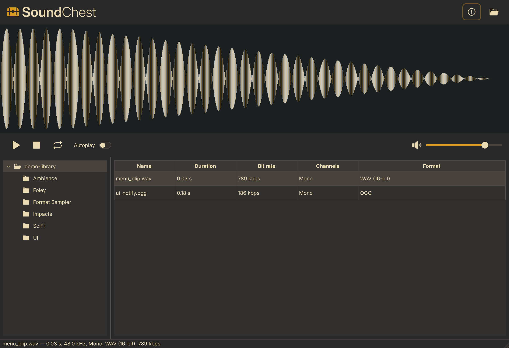
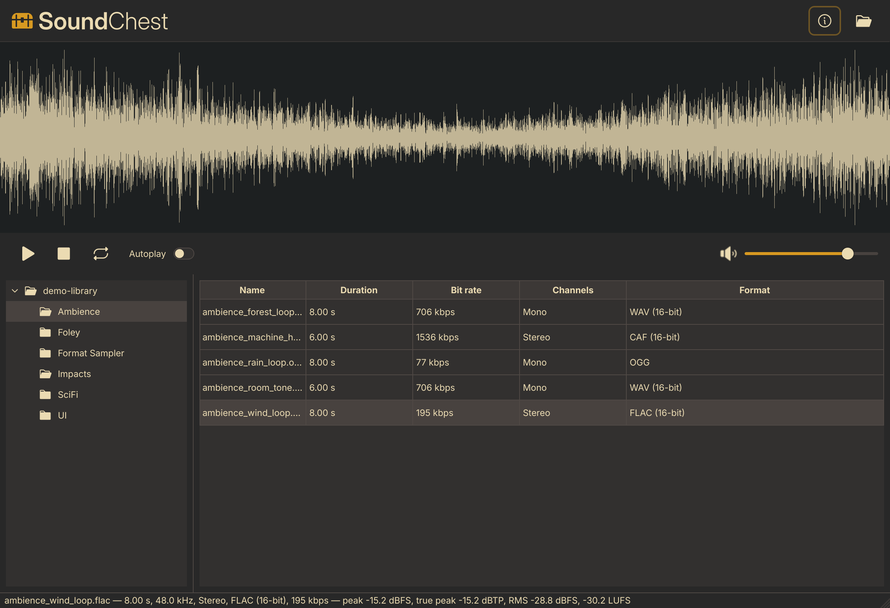
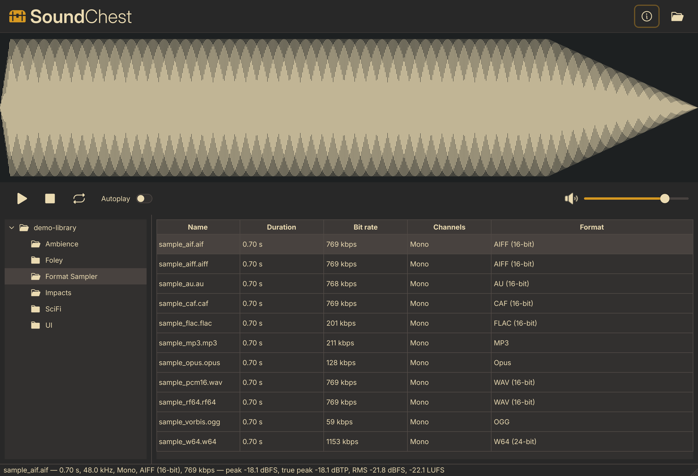
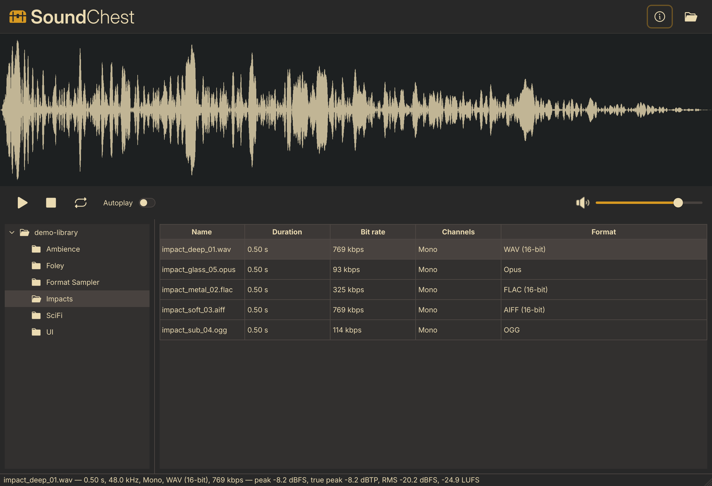

<p align="center">
  <picture>
    <source media="(prefers-color-scheme: dark)" srcset="assets/branding/soundchest-lockup-on-dark.svg">
    
  </picture>
</p>

<p align="center">
  <a href="https://github.com/benjcal/soundchest/actions/workflows/ci.yml"></a>
  <a href="LICENSE"></a>
</p>

<p align="center"><em>Browse and audition a folder full of sound effects.</em></p>

---

Sound Chest is a small desktop app for going through a sound effects library
without opening a DAW or a file manager. I built it because I kept losing time
auditioning samples across folders, and nothing I tried put folder browsing, a
waveform preview, playback, and loudness info in one place.

Point it at a folder, and it scans the tree, lists the audio files with their
metadata, draws the selected file's waveform, and plays it — showing peak, true
peak, RMS and EBU R128 loudness as you go.

## Screenshots

| Browse the folder tree | Pick a sound and audition it |
| --- | --- |
|  |  |
| **Every format at a glance** | **Metadata in the table** |
|  |  |

<!-- Demo GIF goes here once recorded: assets/media/soundchest-demo.gif -->

## Features

- **Folder tree browsing** — recursively scans a folder and keeps the directory
  structure in a tree beside the file list.
- **Waveform preview** — peaks are built off the UI thread, so the window stays
  responsive; click anywhere on the waveform to seek.
- **Playback** — play/pause, stop, loop, autoplay-on-select, and volume.
- **Loudness analysis** — sample peak (dBFS), true peak (dBTP), RMS (dBFS) and
  integrated loudness (LUFS) for the selected file.
- **Drag and drop** — select one or many files and drag them out as file URLs,
  straight into a DAW, game engine, or file manager.
- **Export** — copy selected files to a folder, with rename / overwrite / skip
  handling for name collisions (`Ctrl+E`).
- **Remembers your session** — reopens the last library on launch and restores
  the window size, splitter position, volume and loop/autoplay settings.

## Supported formats

`wav`, `aiff`, `aif`, `au`, `flac`, `ogg`, `opus`, `mp3`, `caf`, `w64`, `rf64`

Metadata is read with [libsndfile](https://github.com/libsndfile/libsndfile);
playback goes through Qt Multimedia (FFmpeg backend).

## Download

Prebuilt Linux AppImages are published on the
[Releases page](https://github.com/benjcal/soundchest/releases/latest).
Download the AppImage, make it executable, and run it:

```sh
chmod +x SoundChest-*-x86_64.AppImage
./SoundChest-*-x86_64.AppImage
```

macOS and Windows builds are planned but not available yet.

## Build from source

Requirements:

- CMake 3.21+ and a C++23 compiler
- Qt 6.8+ — Widgets, Svg, Concurrent, Multimedia
- [Qlementine](https://github.com/oclero/qlementine) (Qt widget style)
- [libsndfile](https://github.com/libsndfile/libsndfile)
- [libebur128](https://github.com/jiixyj/libebur128)

```sh
cmake -S . -B build -DCMAKE_BUILD_TYPE=Release
cmake --build build
./build/soundchest
```

Qt 6.8+ and qlementine are not in most distribution repositories. The
[CI workflow](.github/workflows/ci.yml) builds both from source and is the
reference setup if you hit a wall.

## Keyboard

| Key | Action |
| --- | --- |
| `Space` | Play / pause the selected sound |
| `Return` / `Enter` | Activate the selected sound |
| `Ctrl+E` | Export selected files to a folder |
| `F1` | About Sound Chest |

Click the waveform to seek. Drag files out of the table to copy them elsewhere.

## Credits

Sound Chest is built on:

- [Qt 6](https://www.qt.io) (LGPL-3.0) — application framework
- [Qlementine](https://github.com/oclero/qlementine) (MIT) — widget style
- [libsndfile](https://github.com/libsndfile/libsndfile) (LGPL-2.1-or-later) — audio metadata
- [libebur128](https://github.com/jiixyj/libebur128) (MIT) — loudness measurement
- [FFmpeg](https://ffmpeg.org) via Qt Multimedia (LGPL-2.1-or-later) — decoding
- [Phosphor Icons](https://github.com/phosphor-icons/core) (MIT) — interface icons
- [Inter](https://github.com/rsms/inter) (SIL OFL 1.1) — wordmark letterforms

See [THIRD_PARTY_NOTICES.md](THIRD_PARTY_NOTICES.md) for details.

## License

[MIT](LICENSE) © 2026 Benjamin Calderon
